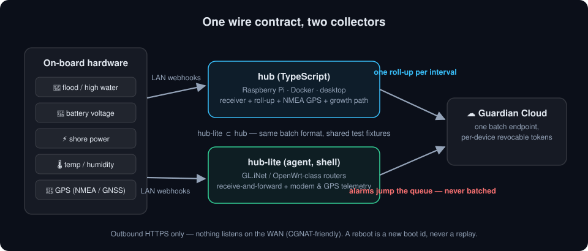
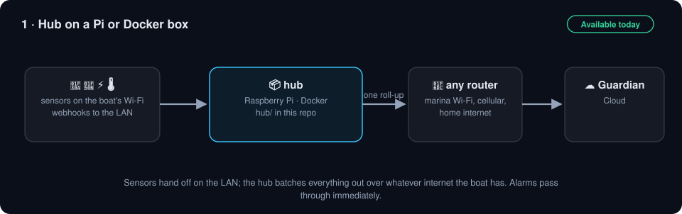
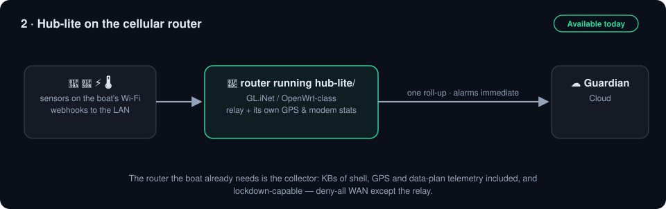
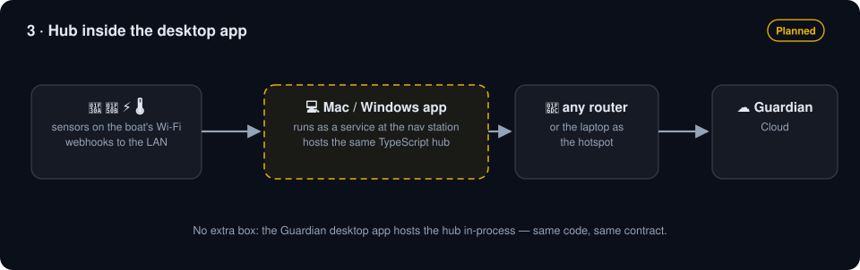
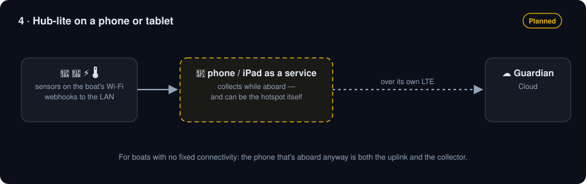
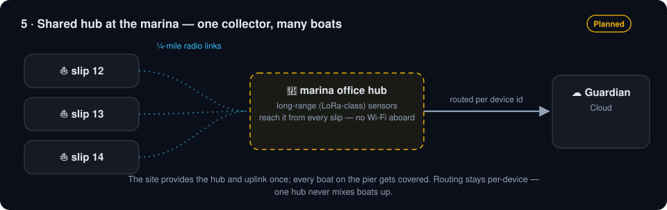

# Boat & RV Guardian — on-site collectors, and the Home Assistant integration

The on-site half of [Boat & RV Guardian](https://boatrvguardian.com): small collectors that run on
the vessel or RV, gather local sensor and GPS telemetry on the LAN, and report it to the Guardian
cloud in one batched roll-up per interval — alarms immediately, never batched.

It also carries the **[Home Assistant integration](custom_components/boatrvguardian/)**, which is the
other side of the same coin: the collectors send telemetry UP to the cloud, and the integration lets a
Home Assistant at your house read it back DOWN. That one is cloud-only by design — it watches a
vessel that is somewhere else, so it never touches the vessel's own network.

Implementations of **one wire contract**:

| | `daemon/` | `hub/` | `agent/` (hub-lite) |
| --- | --- | --- | --- |
| Language | Rust | TypeScript (Node 18+, zero runtime deps) | POSIX shell + uhttpd CGI |
| Hosts | Windows / macOS, as a boot service | Raspberry Pi, Docker, desktop | GL.iNet / OpenWrt-class routers (KBs footprint) |
| Does | webhook receiver, roll-up aggregation, LinkTap valve control, heartbeat; ships an installer and a tray monitor | webhook receiver, roll-up aggregation, NMEA 0183 TCP GPS source | webhook receive-and-forward, roll-up, modem + GPS telemetry, immediate alarm passthrough |

A hub-lite is a **subset of a hub, never a variant**: every side speaks the same batch report
format, and the shared fixtures in each side's tests are what keep them from drifting. If you
change the contract in one place, a test goes red somewhere else — keep it that way.

> ⚠️ **`hub/` is FROZEN — no new capability (owner ruling 2026-08-19).** The project converged on
> the Rust `daemon/` as the one full-hub implementation for every capable host. The TypeScript hub
> keeps working as-is but stops growing; **new hub capability goes in `daemon/`.** `agent/` is
> unaffected — it is the tier for constrained routers, not a duplicate. See `hub/README.md`.

`daemon/` has no README of its own yet. It builds the `brvg-hub` service binary (installed as a
Windows scheduled task or a macOS LaunchDaemon — see `daemon/windows/installer.nsi` and
`daemon/macos/`) plus a `brvg-hub-tray` monitor, and releases through `.github/workflows/daemon-release.yml`.

## Architecture

## Five ways to deploy a collector

The same contract runs everywhere a collector can live. Solid borders are runnable today from this
repo; dashed ones are on the [public roadmap](https://www.boatrvguardian.com/roadmap).

## Integrating

The collectors report over outbound HTTPS only (nothing here listens on the WAN; CGNAT-friendly).
A collector is enrolled from the Guardian app, which mints the per-device token it authenticates
with. To feed your own hardware's telemetry through a collector:

- **GPS**: anything that serves NMEA 0183 over TCP on the LAN (chartplotter, AIS, gpsd, a cellular
  router's GNSS) — point the hub's `NMEA_HOST` at it.
- **Sensors**: HTTP GET/POST webhooks to the collector's LAN port
  (`/cgi-bin/report?device=<id>&event=<name>&<values>`) — events named `*.measurement` / `*.change`
  batch as telemetry; anything else is treated as an alarm and forwarded at once.

See `hub/README.md` and `agent/README.md` for running those tiers; for the daemon, read
`daemon/src/hub_server.rs` and its installer until it has a README.

## License

Apache-2.0 (see `LICENSE` and `NOTICE`). The Guardian **cloud service and apps are separate,
proprietary products** — this repository is the on-site integration surface, published so the
community can run, package, and extend the collectors and connect their own on-board hardware.
"Boat & RV Guardian" branding is a trademark of SC4 Technologies LLC and is not covered by the
code license.
